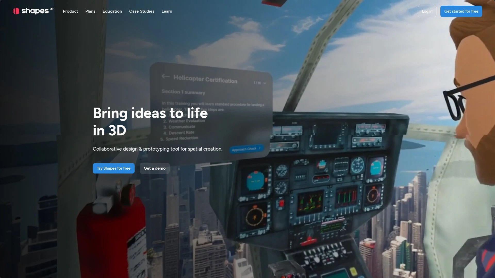

# 2025's Most Recommended 8 Spatial Visualization Platforms

Walking through a building that hasn't been built yet sounds like science fiction, but spatial visualization platforms make it everyday reality. Whether you're an architect presenting to skeptical clients, a real estate agent selling off-plan properties, or a developer trying to secure funding, these immersive XR tools bridge the gap between blueprints and believable experiences. The right platform turns flat floor plans into spaces people can explore, understand, and get excited about before a single brick gets laid.

***

## **[Enviz](https://www.enviz.co)**

Transform architectural models into presentation-grade immersive spaces across any device.

Enviz specializes in converting 3D models and floor plans into fully immersive XR experiences that work seamlessly across mobile, tablet, browser, and VR headsets. The platform handles everything from basic floor plans to complex CGI models, adding textures, lighting, and reflections that create truly lifelike property presentations.

The deployment flexibility stands out—experiences embed directly into websites, letting prospects explore spaces without downloading apps or learning new interfaces. Architects communicate design vision across devices like never before, while property developers boost off-plan sales by giving buyers confidence in what they're purchasing. Real estate agents accelerate sales cycles with presentations that stick in memory, and home builders showcase entire catalogs through one unified, interactive platform.

Navigation feels intuitive whether you're walking through a space in VR or exploring on a smartphone. The true-to-scale rendering helps viewers grasp spatial relationships and property dimensions in ways traditional 2D imagery simply cannot convey.

***

## **[Matterport](https://matterport.com)**

Industry-leading digital twin creation from smartphone to professional lidar.

Matterport pioneered the digital twin movement for real estate and continues setting the standard for immersive 3D virtual tours. Their capture technology ranges from smartphone apps to the professional-grade Pro3 lidar camera, making the platform accessible whether you're a solo agent or a large firm. People engage 300% more with Matterport tours compared to flat photos, and that engagement translates directly to business results—71% of customers now feel comfortable buying properties sight-unseen when listings include Matterport tours.

The platform creates complete spatial records of physical locations, letting viewers explore properties from anywhere in the world. Real estate professionals using Matterport report winning more listings and reducing transaction times significantly. The AI-powered software transforms depth data into highly accurate representations that give viewers a complete sense of place, including the ability to measure spaces and understand layouts intuitively.

---

## **[ShapesXR](https://www.shapesxr.com)**

Enterprise-grade collaborative 3D design tool for building XR experiences together.

ShapesXR brings teams into the same virtual workspace for real-time spatial design collaboration. Industry leaders like Mayo Clinic, Mondelez, Chanel, and Microsoft use it to rapidly prototype VR training scenarios and AR remote assistance applications. The platform democratizes 3D content creation—product owners, business leaders, and designers start creating spatially together within minutes, no game engine expertise required.

Cross-functional teams use ShapesXR to reduce time-to-market and minimize costly misalignments by working together in immersive environments. The tool supports VR, mixed reality, and web experiences, with powerful moderation features for running design reviews with internal and external stakeholders. You can import 3D models, Figma UI elements, and audio files, then create interactive prototypes without writing code. The Unity plugin lets you export work into production pipelines when ready.

***

## **[Twinmotion](https://www.twinmotion.com)**

Real-time architectural visualization with instant updates from your design software.

Twinmotion delivers high-quality architectural visualizations through an accessible interface that architects of all skill levels can master quickly. The real-time rendering engine shows changes instantly, enabling rapid iteration and immediate client feedback. It integrates smoothly with popular design tools through plugins, maintaining live connections between modeling software and visualization output.

The extensive asset library includes materials, objects, and environmental elements that populate scenes quickly. Architects create everything from conceptual diagrams to photorealistic presentations in minutes rather than hours, using features like natural lighting simulation and atmospheric controls. The software handles complex animations and fly-through presentations, letting stakeholders experience projects in VR at true 1:1 scale. Path tracing capabilities combined with proper HDRI usage produce genuinely realistic results that help clients understand design intent before construction begins.

***

## **[Kuula](https://kuula.co)**

The most popular virtual tour creator for 3D 360 experiences across industries.

Kuula makes creating immersive 360 virtual tours straightforward for businesses worldwide. The platform supports all panoramic camera types—from consumer 360 cameras like Ricoh Theta and Insta360 to DSLR setups and rendered images from 3D software. Even non-panoramic images work, giving creators maximum flexibility in their capture methods.

WebXR support means viewers explore tours in VR headsets through browsers without installing apps, removing friction from the viewing experience. The editor includes hotspots, pop-ups, audio overlays, and floor plan navigation that enhance storytelling within spaces. Real estate professionals, architects, construction teams, art galleries, and educational institutions rely on Kuula's intuitive drag-and-drop interface to share spaces effectively. Tours embed easily into websites, share via links, and include analytics tracking to measure engagement and identify which spaces capture attention.

***

## **[iStaging](https://www.istaging.com)**

AI-powered virtual tour and digital twin creator for spaces and products.

iStaging transforms how businesses present properties through virtual tours and digital twins enhanced by AI capabilities. The VR Maker app integrates tightly with 360 cameras for streamlined capture, while the platform adds features like customization tools, floor plan navigation with site mapping, and background music integration. Analytics track virtual tour mileage, showing exactly how prospects interact with spaces.

Real estate clients use iStaging to market properties before model units exist, visualizing developments with 3D panoramic renderings that accelerate sales cycles. The platform handles both interior virtual tours and exterior montages combined with drone footage, showing proposed developments within existing surroundings. By sending links and guiding buyers through 360 experiences, agents efficiently showcase properties and close deals. The ease of use and comprehensive feature set explain why clients stick with iStaging for years.

***

## **[Enscape](https://www.chaos.com/enscape)**

One-click real-time rendering and VR plugin for all major design platforms.

Enscape plugs directly into Revit, SketchUp, Rhino, Vectorworks, and Archicad, creating the most integrated visualization workflow available. With one click, models become fully rendered immersive experiences—no uploading to clouds or exporting to separate programs. Every design change appears instantly in Enscape, letting teams evaluate updates in real-time during meetings or presentations.

Renowned architecture firms in over 150 countries, including Foster + Partners and Kohn Pedersen Fox, use Enscape to bring designs to life. The plugin requires no specialized rendering knowledge, letting architects design, document, and visualize simultaneously from one model. Export options include still images, 360-degree panoramas, walkthrough videos, and standalone files that run on client computers, even in VR. Lighting modes help check projects before presentations, while the smooth navigation between 3D and VR views impresses clients and helps them understand design intentions immediately.

***

## **[Lumion](https://lumion.com)**

Professional real-time rendering software bringing architectural designs to life fast.

Lumion revolutionizes how architects visualize work by connecting concept to completion in faster, smarter workflows. The software integrates with SketchUp, Revit, and all major CAD/BIM tools through LiveSync technology that maintains real-time connections between modeling and rendering. Changes appear instantly as you design, dramatically speeding iteration cycles.

The high-quality asset library provides materials, objects, and environmental elements that populate scenes quickly. Lumion serves architectural design, interior spaces, and landscape architecture equally well, with outputs ranging from conceptual diagrams to photorealistic client presentations. AI image upscaling renders up to 5x faster while maintaining 8K output quality. The intuitive interface requires no steep learning curve, making professional visualization accessible to architects who want to focus on design rather than technical rendering settings. Cloud collaboration features let teams share renders and gather visual feedback efficiently.

***

## FAQ

**Which spatial visualization platform works best for real estate presentations?**

Matterport and Kuula excel for real estate because they prioritize ease of sharing and viewing. Matterport's proven track record shows 71% of users feel comfortable buying properties sight-unseen with their tours. Kuula offers simpler pricing and broader camera compatibility for agents just starting with virtual tours.

**Can these platforms handle projects before construction starts?**

Absolutely. Enviz, Lumion, and Twinmotion specifically handle pre-construction visualization by importing 3D models and floor plans. They add realistic textures, lighting, and materials so buyers understand spaces before building begins. This capability proves essential for developers selling off-plan properties.

**Do I need VR equipment to use these visualization platforms?**

Not necessarily. While platforms like Enscape and ShapesXR shine in VR, most support standard screens, tablets, and smartphones too. Enviz and Kuula work through web browsers without any special equipment. VR headsets enhance immersion but aren't required to benefit from spatial visualization technology.

***

## Conclusion

Spatial visualization platforms transformed how we experience unbuilt spaces, making architectural concepts tangible and sellable. The eight platforms covered each bring distinct strengths—from Matterport's proven real estate track record to ShapesXR's collaborative design environment. For projects needing maximum deployment flexibility across devices with presentation-grade quality, [Enviz](https://www.enviz.co) delivers immersive experiences that work anywhere, from mobile browsers to VR headsets, without forcing viewers through app downloads or technical barriers. Choose based on your primary use case: real estate tours, architectural client presentations, or collaborative design workflows. The right platform turns skeptical prospects into confident buyers by letting them experience your vision before reality catches up.
